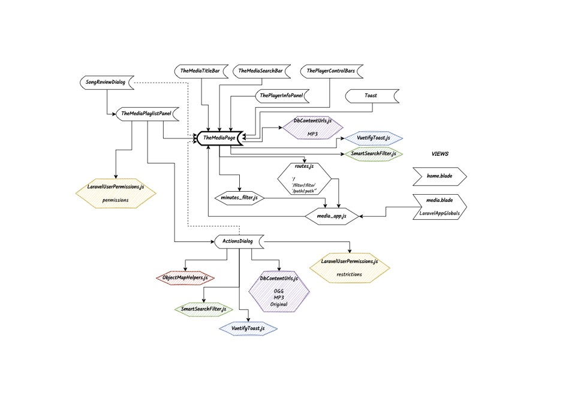
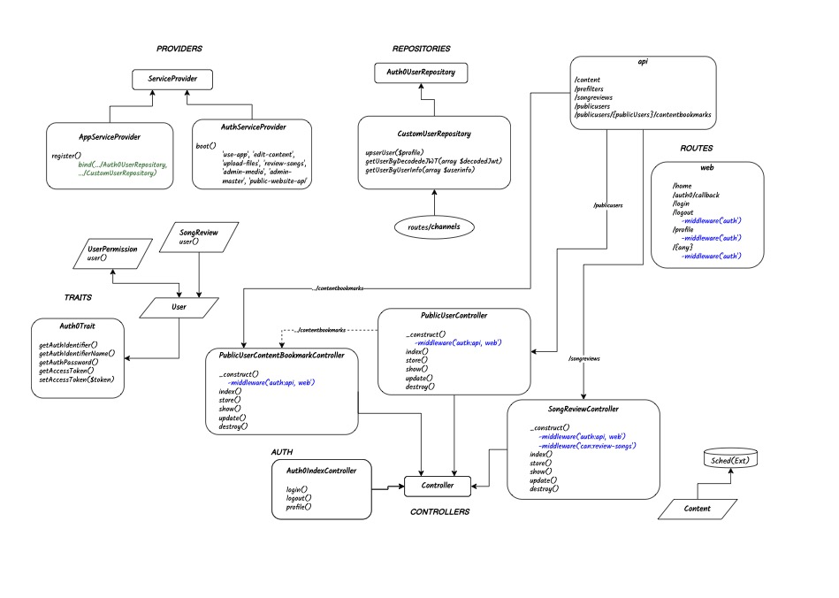

# FaithMedia-V1

The "Faith FM Media Management" is a line-of-business application to help manage our media content library. It enables producers, reviewers, and content managers to handle Faith FM's media content database efficiently.

## Key Features
- Content library management and preview
- Audio player with metadata editing
- Smart search and filtering
- Review system for content feedback
- User management and permissions
- Standardized error handling with sheep-themed messages

## Quick Start

### Requirements
- PHP ^8.1
- Node.js
- Composer
- Git

### Development Setup
1. Clone the repository
2. Copy `.env.example` to `.env` and configure
3. Install dependencies:
   ```bash
   composer install
   npm install
   ```
4. Start development server:
   ```bash
   php artisan serve
   npm run dev
   ```

For detailed technical documentation, please refer to [docs/TechnicalSpecification.md](docs/TechnicalSpecification.md).

## Architecture Overview

This is a hybrid Laravel + Vue application:
* Not strictly a "Single Page Application (SPA)"
* Vue front-end is dynamically served by Laravel Blade templates
* Some routes bypass Vue entirely
* Data is sourced via:
  * AJAX calls to the API
  * Configuration injection using window.xxx variables (similar to Laravel's CSRF token injection via meta tags)
* Authentication uses Laravel's stateful session-based approach rather than JWT
* API routes in `api.php` are configured to support stateful authentication alongside stateless token-based authentication
* Styling approach:
  * Vuetify 3 for primary UI components
  * TailwindCSS specifically for error page styling
  * SASS for custom styles

## Error Handling

The application implements a standardized error handling pattern with:
- Custom error pages for common HTTP status codes (401, 403, 404, 500, 503)
- Sheep-themed error messages for user-friendly experience
- Consistent styling using TailwindCSS
- Interactive elements (back button, login button when applicable)
- Debug mode support for detailed error information

## System Diagrams

Front-end Architecture:


Back-end Architecture:

