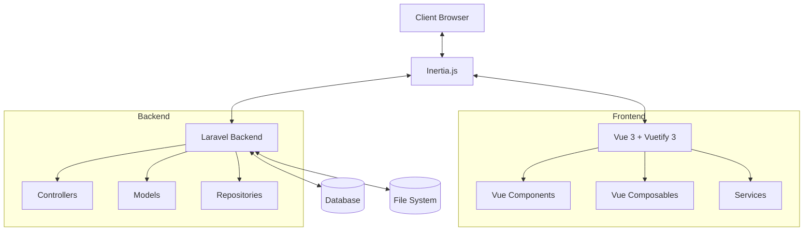
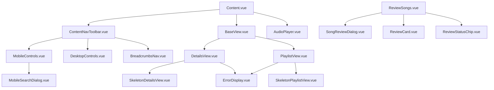
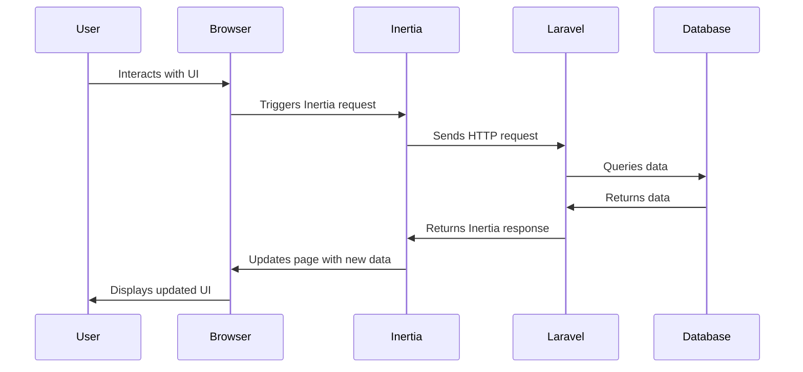
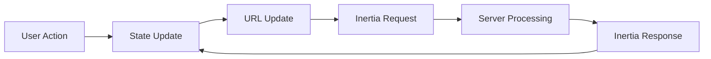
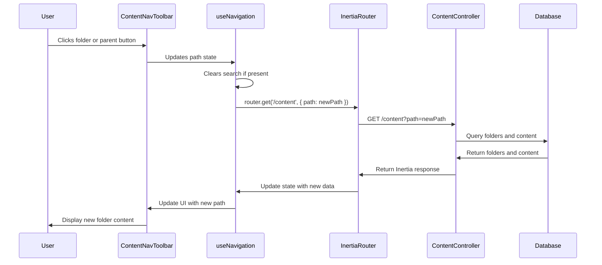
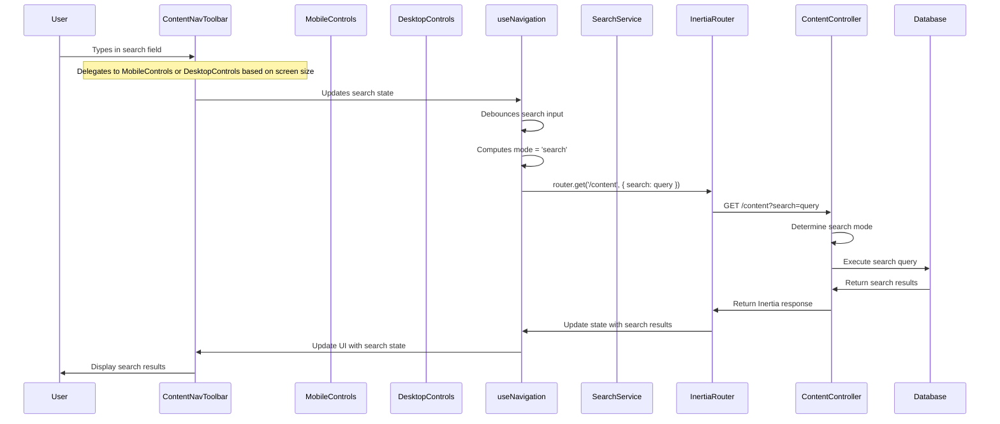
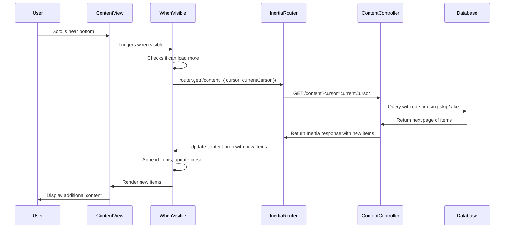
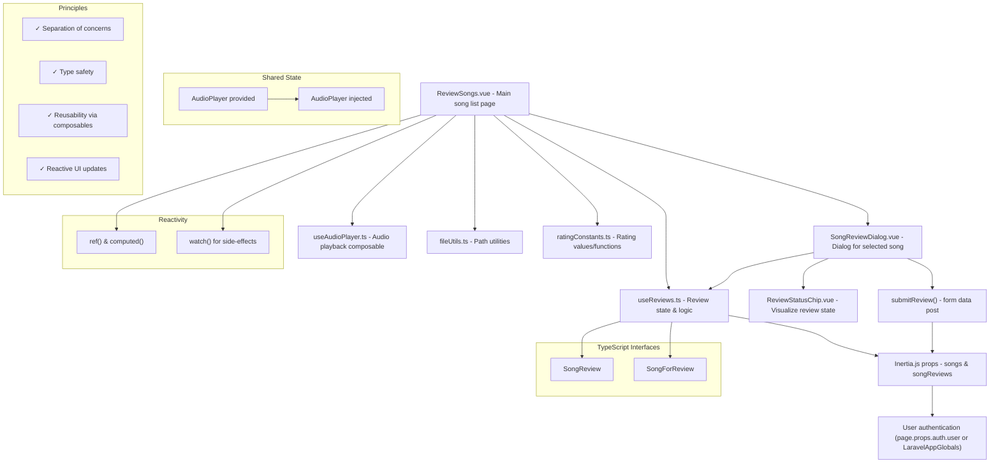
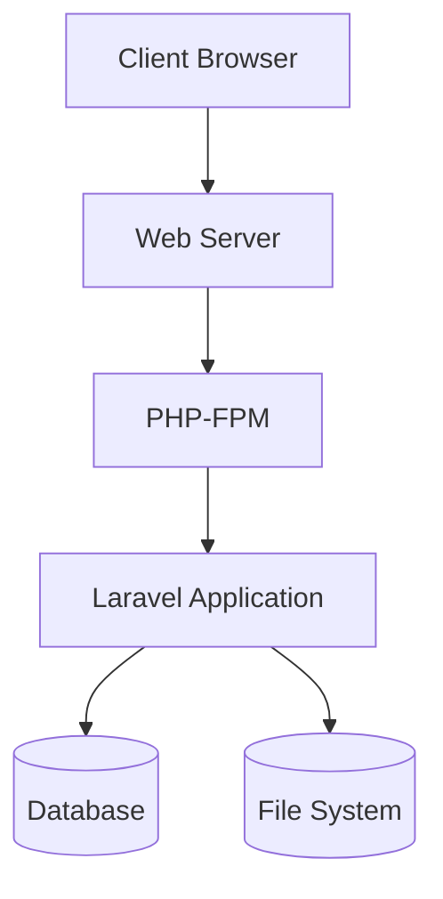

# Architecture Documentation

This document provides a comprehensive overview of the architecture for the FaithMedia project. It covers the system architecture, project structure, data flow, state management, and key design decisions.

## Table of Contents

1. [Introduction](#introduction)
2. [System Architecture Overview](#system-architecture-overview)
3. [Frontend Architecture](#frontend-architecture)
4. [Backend Architecture](#backend-architecture)
5. [Project Structure](#project-structure)
6. [Data Flow](#data-flow)
7. [State Management](#state-management)
8. [Key Design Decisions](#key-design-decisions)
9. [Technology Stack](#technology-stack)
10. [Deployment, Security, and Performance Considerations](#deployment-security-and-performance-considerations)
11. [Best Practices](#best-practices)
12. [Related Documentation](#related-documentation)

## Introduction

This document provides a comprehensive overview of the architecture for the Vue3/Vuetify3/Inertia implementation of the FaithMedia project. It outlines the system's structure, key components, data flow, and design decisions.

The architecture is designed to be modern, maintainable, and performant. By leveraging Vue 3, Vuetify 3, and Inertia.js, we've created a system that provides a great user experience while being developer-friendly.

## System Architecture Overview

The FaithMedia project follows a modern client-server architecture using Laravel as the backend framework and Vue 3 with Inertia.js for the frontend. This architecture provides several advantages:

- **Monolithic Simplicity**: By using Inertia.js, we maintain the simplicity of a monolithic application while gaining the benefits of a modern SPA.
- **Progressive Enhancement**: The application works even without JavaScript, as Inertia.js supports server-side rendering.
- **Reduced API Complexity**: No need to build and maintain a separate API layer.
- **Shared Authentication**: Authentication is handled by Laravel, eliminating the need for token management.

### High-Level Architecture Diagram



## Frontend Architecture

The frontend architecture is built on Vue 3 using the Composition API and TypeScript for improved type safety and developer experience.

### Key Frontend Components

1. **Inertia.js Integration**: Bridges Laravel and Vue, handling page transitions and state management.
2. **Vue 3 Composition API**: Provides a more flexible and reusable code organization approach.
3. **Vuetify 3**: Offers a comprehensive UI component library with Material Design styling.
4. **TypeScript**: Ensures type safety and improves code quality.
5. **Composables**: Encapsulate and reuse logic across components.

### Frontend Layer Structure

The frontend is organized into several distinct layers:

1. **Pages Layer**: Inertia page components that represent routes.
   - Example: `Content.vue` (main content page)

2. **Components Layer**: Reusable UI elements.
   - Examples: `ContentNavToolbar.vue`, `MobileControls.vue`, `DesktopControls.vue`, `BaseView.vue`, `DetailsView.vue`, `PlaylistView.vue`

3. **Composables Layer**: Reusable logic (hooks).
   - Examples: `useRowSelection.ts`, `useAudioPlayer.ts`, `useReviews.ts`

4. **Services Layer**: External data interactions.
   - Example: `SearchService.ts`

5. **Utils Layer**: Pure utility functions.
   - Example: `fileUtils.ts`

6. **Types Layer**: TypeScript type definitions.
   - Example: `models.ts`

### Component Architecture

Components follow a hierarchical structure:



## Backend Architecture

The backend architecture is built on Laravel, following standard Laravel conventions with some specific adaptations for Inertia.js.

### Key Backend Components

1. **Controllers**: Handle HTTP requests and return Inertia responses.
   - Example: `ContentController.php`

2. **Models**: Represent database entities and their relationships.
   - Examples: `Content.php`, `Prefilter.php`

3. **Repositories**: Encapsulate data access logic.
   - Example: `ContentRepository.php`

4. **Requests**: Handle validation and authorization.
   - Example: `ContentRequest.php`

### Backend Layer Structure

The backend follows Laravel's standard MVC architecture:

1. **Routes**: Define the application's URL structure.
   - Located in `routes/web.php`

2. **Controllers**: Handle requests and return responses.
   - Located in `app/Http/Controllers`

3. **Models**: Represent database entities.
   - Located in `app/Models`

4. **Migrations**: Define database schema.
   - Located in `database/migrations`

5. **Repositories**: Encapsulate data access logic.
   - Located in `app/Repositories`

## Project Structure

The project structure follows Laravel and Inertia.js conventions with a simplified organization to improve maintainability.

### Directory Structure

```
resources/js/
  ├── LaravelUserPermissions.js  # Laravel permissions helper
  ├── app.js                     # Main application entry point
  │
  ├── Pages/              # Inertia page components
  │   ├── Content.vue
  │   ├── Error.vue
  │   ├── ReviewSongs.vue
  │   └── ReviewSongsSummary.vue
  │
  ├── components/         # All Vue components
  │   ├── AudioPlayer.vue
  │   ├── BaseView.vue
  │   ├── BreadcrumbsNav.vue
  │   ├── ContentNavToolbar.vue
  │   ├── DesktopControls.vue
  │   ├── DetailsView.vue
  │   ├── EditableTable.vue
  │   ├── ErrorDisplay.vue
  │   ├── FolderPanel.vue
  │   ├── MobileControls.vue
  │   ├── MobileSearchDialog.vue
  │   ├── PlaylistView.vue
  │   ├── ReviewCard.vue
  │   ├── ReviewStatusChip.vue
  │   ├── SkeletonDetailsView.vue
  │   ├── SkeletonPlaylistView.vue
  │   └── SongReviewDialog.vue
  │
  ├── composables/        # Vue composables
  │   ├── useAudioPlayer.ts
  │   ├── useContentHelpers.ts
  │   ├── useDbContentUrls.ts
  │   ├── useErrorHandling.ts
  │   ├── useNavigation.ts
  │   ├── useNotifications.ts
  │   ├── useReviews.ts
  │   ├── useReviewSummaries.ts
  │   ├── useRowSelection.ts
  │   ├── useSearchHighlighting.ts
  │   └── useSharedData.ts
  │
  ├── constants/          # Application constants
  │   └── ratingConstants.ts
  │
  ├── directives/         # Vue directives (empty)
  │
  ├── layouts/            # Layout components
  │   └── SharedLayout.vue
  │
  ├── services/           # Services
  │   └── SearchService.ts
  │
  ├── types/              # TypeScript types
  │   ├── lodash.d.ts
  │   └── models.ts
  │
  └── utils/              # Utility functions
      └── fileUtils.ts
```

### File Organization Principles

#### Flat Structure

We've adopted a flat structure for better maintainability. All components are directly under `components/` without deep nesting. This approach:

- Makes it easier to locate files
- Avoids complex import paths
- Reduces the cognitive load of understanding the project structure
- Simplifies refactoring and moving components

#### Separation of Concerns

The project follows a clear separation of concerns:

1. **Pages**: Top-level Inertia page components that represent routes
2. **Components**: Reusable UI elements
3. **Composables**: Reusable logic (hooks)
4. **Services**: External data interactions
5. **Utils**: Pure utility functions
6. **Directives**: Vue-specific DOM manipulations
7. **Types**: TypeScript type definitions

#### Naming Conventions

- **Components**: PascalCase (e.g., `ContentNavToolbar.vue`)
- **Composables**: camelCase with `use` prefix (e.g., `useRowSelection.ts`)
- **Services**: PascalCase with `Service` suffix (e.g., `SearchService.ts`)
- **Utils**: camelCase (e.g., `fileUtils.ts`)
- **Directives**: camelCase with `v` prefix (e.g., `vLazyImg.ts`)

### Key Components

#### Content.vue

The main Inertia page component that serves as the entry point for the content page. It:

- Handles URL parameter parsing and normalization
- Manages the overall state (folder/search mode)
- Coordinates between navigation and content views
- Integrates with the audio player

#### ContentNavToolbar.vue

Provides the main navigation interface that adapts to different screen sizes:

- Responsive design that uses different controls for mobile and desktop
- Folder navigation with breadcrumbs and history
- Integration with MobileControls and DesktopControls components

#### MobileControls.vue

Provides navigation controls optimized for mobile devices:

- Search button with expandable search dialog
- More menu with filter, subfolder, sort, and view options
- Touch-friendly interface elements

#### DesktopControls.vue

Provides navigation controls optimized for desktop devices:

- Filter chip with dropdown menu
- Search field with history
- Include subfolders toggle
- Sort direction toggle
- View mode toggle
- Touch-friendly interface elements

#### BaseView.vue

Abstract base component that defines the interface for different view implementations:

- Provides common functionality for all views
- Handles row selection
- Manages context menus and double-click actions

#### DetailsView.vue

Table-based view optimized for folder browsing:

- Displays files in a detailed table format
- Supports horizontal scrolling
- Separates file and path columns
- Default view for folder mode

#### PlaylistView.vue

Grid-based view optimized for media browsing:

- Displays files in a visual grid format
- Optimized for media preview
- Default view for search mode
- Includes action menu

## Data Flow

The data flow in the application follows a clear path from user interaction to data display.

### Request-Response Cycle



### State Management Flow



### Folder Navigation Flow



### Search Flow



### Infinite Pagination Flow



### Song Review Data Flow

The following diagram illustrates the data flow within the Song Review functionality, showing how data is handled between components and composables:



This diagram shows:
1. The relationship between the main components (`ReviewSongs.vue` and `SongReviewDialog.vue`)
2. How these components interact with composables like `useReviews.ts` and `useAudioPlayer.ts`
3. The data flow from Inertia.js props to components
4. How user information is accessed
5. The shared state pattern using Vue's provide/inject system
6. The review submission flow back to the server
7. The use of Vue's reactivity system
8. The TypeScript interfaces that ensure type safety
9. The key architectural principles applied in this feature

## State Management

The FaithMedia project uses a composable-based state management approach rather than a centralized store like Vuex or Pinia. This approach leverages Vue 3's Composition API to create modular, reusable state management solutions that are tailored to specific concerns.

### Key Benefits

1. **Modularity**: State is divided into logical, focused modules
2. **Reusability**: Composables can be reused across components
3. **Type Safety**: TypeScript integration is more natural
4. **Testing**: Easier to test in isolation
5. **Performance**: Fine-grained reactivity for better performance
6. **Simplicity**: No need for complex store setup, mutations, or actions
7. **Integration with Inertia**: Direct access to Inertia props via computed properties

### Core State Areas

The application state is managed through focused composables that handle specific areas of functionality:

1. **Audio Management**: Handled by `useAudioPlayer.ts` for audio playback functionality
2. **Content Management**: Managed by `useContentHelpers.ts` and `useDbContentUrls.ts` for content operations
3. **Navigation**: Controlled by `useNavigation.ts` for navigation state and functionality
4. **Row Selection**: Managed by `useRowSelection.ts` for selected and playing items
5. **Error Handling**: Centralized by `useErrorHandling.ts` with consistent response structure
6. **Notifications**: Handled by `useNotifications.ts` for notification display and management
7. **Review Management**: Managed by `useReviews.ts` and `useReviewSummaries.ts` for song review functionality
8. **Search**: Enhanced by `useSearchHighlighting.ts` for search result highlighting
9. **Shared Data**: Coordinated by `useSharedData.ts` for data shared across components

### Composables

The project uses individual composables for specific concerns rather than a centralized state management system. The composables in the project are:

1. **useAudioPlayer.ts**: Manages audio playback functionality
2. **useContentHelpers.ts**: Provides helper functions for content management
3. **useDbContentUrls.ts**: Handles database content URL generation
4. **useErrorHandling.ts**: Centralizes error handling logic
5. **useNavigation.ts**: Manages navigation state and functionality
6. **useNotifications.ts**: Handles notification display and management
7. **useReviews.ts**: Manages song review functionality
8. **useReviewSummaries.ts**: Handles review summary data
9. **useRowSelection.ts**: Manages row selection state
10. **useSearchHighlighting.ts**: Provides search result highlighting
11. **useSharedData.ts**: Manages shared data across components

Each composable focuses on a specific domain and provides reactive state and methods related to that domain. This modular approach allows for better code organization, reusability, and testing.

### State Persistence

The application uses several strategies for state persistence:

1. **URL State**: The primary state is persisted in the URL, allowing for bookmarking and sharing
2. **Local Storage**: User preferences are stored in local storage for persistence across sessions
3. **Inertia Preserved State**: Inertia.js provides a mechanism to preserve state during navigation

### State Management Patterns

#### Direct Inertia Props Access

For data that comes from the server, the application uses computed properties that directly reference Inertia props. This pattern eliminates the need to synchronize local state with server state, reducing complexity and potential bugs.

#### Partial Page Updates

For state updates that require server interaction, the application uses Inertia's partial page updates with the `only` parameter. This ensures that only the necessary data is refreshed, maintaining UI state and improving performance.

### State Optimization Techniques

The application implements several optimization techniques for state management:

1. **Debounced Updates**: Prevent excessive updates for rapidly changing values
2. **Batched Updates**: Updates to related state are batched to prevent cascading re-renders
3. **Memoization**: Expensive computations are memoized to prevent redundant calculations
4. **Lazy Loading**: Expensive data is loaded lazily using Inertia::lazy()
5. **Centralized Error Handling**: Standardized error handling with consistent response structure

## Key Design Decisions

### 1. Inertia.js over Traditional SPA

We chose Inertia.js over a traditional SPA architecture for several reasons:

- **Simplified Development**: No need to build and maintain a separate API
- **Shared Authentication**: Uses Laravel's built-in authentication
- **Reduced Complexity**: Fewer moving parts and potential points of failure
- **Progressive Enhancement**: Works even without JavaScript

### 2. Composition API over Options API

We chose the Composition API over the Options API for:

- **Better Code Organization**: Related code is grouped together
- **Improved Type Safety**: TypeScript integration is more natural
- **Enhanced Reusability**: Logic can be extracted into composables
- **More Flexibility**: More control over code structure

### 3. Cursor-Based Pagination over Offset Pagination

We implemented cursor-based pagination for:

- **Consistent Performance**: Performance remains stable regardless of offset
- **Reduced Database Load**: More efficient queries
- **Better Cache Utilization**: More cache-friendly queries

### 4. Component Hierarchy

We designed the component hierarchy to:

- **Maximize Reusability**: Components are designed to be reusable
- **Minimize Prop Drilling**: Composables are used to share state
- **Separate Concerns**: Each component has a single responsibility
- **Optimize Performance**: Components are optimized for rendering performance

### 5. Flat Directory Structure

We chose a flat directory structure for:

- **Simplified Navigation**: Easier to find files
- **Reduced Complexity**: Fewer levels of nesting
- **Improved Maintainability**: Easier to refactor and move files
- **Better Developer Experience**: Less cognitive load

## Technology Stack

### Frontend

- **Vue 3**: JavaScript framework for building user interfaces
- **Vuetify 3**: Material Design component framework
- **TypeScript**: Typed superset of JavaScript
- **Inertia.js**: Library for building single-page applications
- **Vite**: Build tool and development server

### Backend

- **Laravel**: PHP framework for web applications
- **MySQL/MariaDB**: Relational database
- **PHP 8.x**: Programming language

## Deployment, Security, and Performance Considerations

### Deployment Architecture

The application is deployed using a standard Laravel deployment architecture:



### Security Considerations

The application implements several security measures:

1. **Authentication**: Uses Laravel's built-in authentication system
2. **Authorization**: Implements role-based access control
3. **CSRF Protection**: Protects against cross-site request forgery
4. **XSS Protection**: Prevents cross-site scripting attacks
5. **SQL Injection Protection**: Uses Laravel's query builder and Eloquent ORM
6. **Input Validation**: Validates all user input

### Performance Considerations

The application implements several performance optimizations:

1. **Cursor-Based Pagination**: For efficient data loading
2. **Virtual Scrolling**: For rendering large datasets
3. **Lazy Loading**: For images, components, and data
4. **State Management Optimization**: To reduce unnecessary re-renders
5. **Optimized Animations**: For smooth user experience

### Scalability Considerations

The application is designed to scale in several ways:

1. **Horizontal Scaling**: Multiple application servers can be added
2. **Database Scaling**: Database can be scaled independently
3. **Caching**: Implements caching for frequently accessed data
4. **Efficient Queries**: Optimized database queries for performance

## Best Practices

### State Management Best Practices

1. **Use Composables for State Management**: Extract state management logic into composables for better reusability and testability
2. **Keep State Close to Where It's Used**: Keep state as close as possible to where it's used
3. **Use TypeScript for Type Safety**: Define TypeScript interfaces for state to ensure type safety
4. **Minimize Reactive Dependencies**: Keep reactive dependencies minimal to prevent unnecessary re-renders
5. **Use Computed Properties for Derived State**: Use computed properties for derived state instead of methods
6. **Batch Related State Changes**: Batch related state changes to prevent cascading re-renders
7. **Use Watchers Judiciously**: Use watchers judiciously and prefer computed properties when possible
8. **Handle Cleanup in onUnmounted**: Clean up event listeners and other resources in onUnmounted

### Component Best Practices

1. **Single Responsibility Principle**: Each component should have a single responsibility
2. **Props Down, Events Up**: Pass data down via props, communicate up via events
3. **Use Slots for Flexibility**: Use slots to make components more flexible
4. **Keep Components Small**: Break large components into smaller, more manageable pieces
5. **Use TypeScript for Props and Events**: Define TypeScript interfaces for props and events
6. **Avoid Deep Component Nesting**: Prefer a flatter component hierarchy
7. **Use Composition API for Complex Components**: Use the Composition API for complex components
8. **Test Components in Isolation**: Write unit tests for components in isolation

### Performance Best Practices

1. **Use Lazy Loading**: Lazy load components, routes, and assets
2. **Optimize Rendering**: Use v-once, v-memo, and shallowRef where appropriate
3. **Minimize DOM Updates**: Batch DOM updates and use keys for efficient list rendering
4. **Optimize Images**: Use appropriate image formats and sizes
5. **Use Pagination**: Implement pagination for large datasets
6. **Debounce Input Handlers**: Debounce input handlers for better performance
7. **Memoize Expensive Computations**: Use memoization for expensive computations
8. **Use Web Workers for CPU-Intensive Tasks**: Offload CPU-intensive tasks to web workers

## Related Documentation

- [Technical Specification](TechnicalSpecification.md) - Comprehensive technical specification
- [API & Technical Implementation](API.md) - API reference and technical details
- [Component Documentation](Components.md) - UI component documentation
