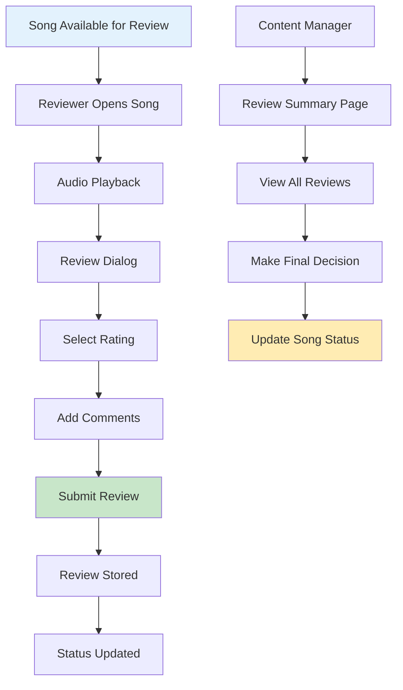

# Feature Documentation

This document consolidates feature-specific documentation for the FaithMedia project, including the Song Review System, Song Review Summary System, and Audio Library Selection Criteria.

## Table of Contents

1. [Prefilter URL Override](#prefilter-url-override)
   - [Feature Overview](#prefilter-url-override-overview)
   - [Implementation Details](#prefilter-url-override-implementation)
   - [URL Behavior](#prefilter-url-override-behavior)

2. [Custom Breadcrumb Navigation](#custom-breadcrumb-navigation)
   - [Feature Overview](#custom-breadcrumb-overview)
   - [Implementation Details](#custom-breadcrumb-implementation)
   - [Technical Challenges](#custom-breadcrumb-challenges)
   - [Solution Architecture](#custom-breadcrumb-solution)

3. [Song Review System](#song-review-system)
   - [Feature Overview](#song-review-feature-overview)
   - [Technical Architecture](#song-review-technical-architecture)
   - [Implementation Details](#song-review-implementation-details)
   - [User Interface](#song-review-user-interface)
   - [Migration Recommendations](#song-review-migration-recommendations)

4. [Song Review Summary System](#song-review-summary-system)
   - [Feature Overview](#song-review-summary-feature-overview)
   - [Technical Architecture](#song-review-summary-technical-architecture)
   - [Implementation Details](#song-review-summary-implementation-details)
   - [User Interface](#song-review-summary-user-interface)
   - [Business Logic](#song-review-summary-business-logic)
   - [Integration Points](#song-review-summary-integration-points)

5. [Audio Library Selection Criteria](#audio-library-selection-criteria)
   - [Primary Use Cases](#primary-use-cases)
   - [Required Format Compatibility](#required-format-compatibility)
   - [UI Integration](#ui-integration)
   - [Performance & Optimization](#performance--optimization)
   - [Framework Compatibility](#framework-compatibility)
   - [Recommended Audio Library](#recommended-audio-library)

---

## Prefilter URL Override

<a id="prefilter-url-override-overview"></a>
### Feature Overview

The Prefilter URL Override feature creates simplified URLs when prefilters are selected, using query parameters to create more intuitive and shareable URLs.

#### Key Benefits
- **Simplified URLs**: URLs use query parameters for prefilters
- **Improved User Experience**: URLs are more intuitive and consistent
- **Shareable Links**: Users can easily share specific filtered views
- **Consistent Behavior**: Subfolders are always included by default

<a id="prefilter-url-override-implementation"></a>
### Implementation Details

When a prefilter is selected, the system:

1. Always navigates to the root content path (`/content`)
2. Adds the prefilter as a query parameter (`?prefilter=biblestudy`)
3. Includes subfolders by default
4. Applies the prefilter's filter to the content query

#### Backend Implementation

The implementation involves modifying the `ContentController` to handle prefilters as query parameters:

```php
// Default includeSubfolders to true in all cases
$includeSubfolders = filter_var($request->query('includeSubfolders', 'true'), FILTER_VALIDATE_BOOLEAN);

// If a prefilter is specified, use it as the primary filter
if ($prefilterSlug) {
    $prefilter = Prefilter::where('slug', $prefilterSlug)->first();
    if ($prefilter) {
        // Apply the prefilter's filter directly
        $query = $query->smartSearch($prefilter->filter, $searchFields);
    }
} else {
    // If no prefilter, filter by path
    $query = $query->where('file', 'like', $baseFilter);

    // Exclude files in subfolders if not including subfolders
    if (!$includeSubfolders) {
        $query = $query->where('file', 'not like', $baseFilter . '/%');
    }
}
```

#### Frontend Implementation

The frontend implementation involves modifying the URL encoding logic to handle prefilters as query parameters:

```typescript
// Action Methods
const selectFilter = (filterSlug: string) => {
  addRecentFilter(filterSlug)
  
  // Find the selected prefilter to get its filter value
  const selectedPrefilter = props.prefilters.find(p => p.slug === filterSlug)
  
  if (selectedPrefilter) {
    // Special case for "all-content" prefilter
    if (filterSlug === 'all-content') {
      // For the "all-content" prefilter, use the root path without query parameters
      navigate({ 
        path: '',  // Root path
        prefilter: ''  // Don't include in query params
      })
      return
    }
    
    // Always navigate to the root path with prefilter as query parameter
    navigate({ 
      path: '',  // Root path
      prefilter: filterSlug,  // Use the slug as the prefilter parameter
      includeSubfolders: true  // Always include subfolders
    })
  } else {
    // Fallback to query parameter if prefilter not found
    navigate({ 
      path: '',
      prefilter: filterSlug,
      includeSubfolders: true
    })
  }
}
```

<a id="prefilter-url-override-behavior"></a>
### URL Behavior

#### Before Implementation
When selecting a Bible Study prefilter with filter value `file:sa/biblestudy/*`:
```
https://faithmedia-v1.test/content/sa/biblestudy
```

#### After Implementation
The URL now uses query parameters:
```
https://faithmedia-v1.test/content?prefilter=biblestudy
```

The frontend still maintains awareness of which prefilter is active, ensuring the filter chip in the ContentNavToolbar correctly shows the active prefilter.

#### Technical Considerations

- **Prefilter Slug**: The prefilter slug is used as the query parameter value
- **Subfolders Inclusion**: Subfolders are included by default in all contexts
- **Path Navigation**: The URL always navigates to the root content path
- **Filter Application**: The prefilter's filter is applied directly to the content query

---

## Custom Breadcrumb Navigation

<a id="custom-breadcrumb-overview"></a>
### Feature Overview

The Custom Breadcrumb Navigation feature provides intuitive folder navigation through a breadcrumb interface that correctly handles path navigation in the content library.

#### Key Benefits
- **Intuitive Navigation**: Users can easily navigate up the folder hierarchy
- **Path Clarity**: Visual representation of the current location in the folder structure
- **Direct Access**: One-click navigation to any parent folder
- **Consistent Behavior**: Properly handles path navigation without duplication

<a id="custom-breadcrumb-implementation"></a>
### Implementation Details

The implementation uses a dedicated BreadcrumbsNav component instead of Vuetify's built-in breadcrumbs due to specific path handling requirements:

1. All paths are stored internally WITHOUT the '/content/' prefix
2. The prefix is only added when constructing the final URL
3. Special handling ensures correct navigation when clicking breadcrumb items
4. Responsive design that intelligently adapts to screen size and device orientation

#### BreadcrumbsNav Component

The BreadcrumbsNav component (`resources/js/components/BreadcrumbsNav.vue`) provides a responsive breadcrumb navigation interface that intelligently adapts to different screen sizes and device orientations:

```html
<template>
  <div class="custom-breadcrumbs d-flex align-center">
    <template v-if="breadcrumbs.length > 0">
      <template v-for="(item, index) in breadcrumbs" :key="index">
        <!-- Only show items that should be visible -->
        <template v-if="shouldShowItem(index)">
          <!-- Add chevron between visible items -->
          <v-icon 
            v-if="isNotFirstVisibleItem(index)" 
            icon="mdi-chevron-right" 
            size="small" 
            class="mx-1 chevron-divider" 
          />
          
          <!-- Show ellipsis for collapsed middle items -->
          <span 
            v-if="isEllipsis(index)" 
            class="text-body-2 text-truncate ellipsis-breadcrumb text-red-darken-4 cursor-pointer"
            @click="showEllipsisMenu"
          >
            ...
          </span>
          
          <!-- Show regular breadcrumb item -->
          <span
            v-else
            class="text-body-2 text-truncate"
            :class="getItemClasses(index)"
            @click.prevent="item.disabled ? null : handleBreadcrumbClick(item)"
          >
            {{ item.title }}
          </span>
          
          <!-- Dropdown menu for ellipsis -->
          <v-menu v-if="isEllipsis(index)">
            <!-- Menu implementation for collapsed items -->
          </v-menu>
        </template>
      </template>
    </template>
  </div>
</template>
```

#### Responsive Behavior

The BreadcrumbsNav component intelligently adapts to different screen sizes and device orientations:

1. **Orientation Detection**: Detects device orientation (portrait vs. landscape) to optimize display
2. **Adaptive Collapsing**: 
   - On mobile in portrait mode: Collapses if more than 2 breadcrumbs
   - On small screens in portrait mode: Collapses if more than 3 breadcrumbs
   - In landscape mode: Shows more breadcrumbs before collapsing
   - Always collapses if more than 4 breadcrumbs
3. **Ellipsis Menu**: When breadcrumbs are collapsed, shows an ellipsis with a dropdown menu to access hidden items
4. **Touch-Friendly Design**: Optimized for touch with appropriate sizing and spacing

#### Path Handling Logic

The breadcrumb generation logic in `useNavigation.ts` creates breadcrumb items with absolute paths:

```typescript
// Compute breadcrumb items from current path
const breadcrumbs = computed<BreadcrumbItem[]>(() => {
  // Clean the path - remove any leading/trailing slashes and ensure no '/content/' prefix
  const path = pathRef.value.trim()
    .replace(/^\/+/, '')  // Remove leading slashes
    .replace(/\/+$/, '')  // Remove trailing slashes
    .replace(/^content\//, '')  // Remove 'content/' prefix if present
  
  if (!path) return []

  const segments = path.split('/')
  
  // Create breadcrumbs with clean, absolute paths (no '/content/' prefix)
  return segments.map((segment: string, index: number) => {
    // Create a clean absolute path up to this segment
    const absolutePath = segments.slice(0, index + 1).join('/')
    
    return {
      label: segment || 'Root',
      path: absolutePath, // Store clean path without '/content/' prefix
      isLast: index === segments.length - 1
    }
  })
})
```

#### Navigation Handler

The `handleBreadcrumbClick` function in `ContentNavToolbar.vue` ensures proper navigation:

```typescript
const handleBreadcrumbClick = (item: any) => {
  if (!item.href || item.disabled) return;
  
  // Clean the path to ensure consistent format
  const cleanPath = item.href
    .trim()
    .replace(/^\/+/, '')
    .replace(/\/+$/, '')
    .replace(/^content\//, '')
  
  // Update local state
  path.value = cleanPath
  
  // Construct query parameters
  const queryParams = new URLSearchParams()
  // Preserve all current query parameters
  if (prefilter.value) queryParams.set('prefilter', prefilter.value)
  if (searchInput.value) queryParams.set('search', searchInput.value)
  if (sort.value !== 'asc') queryParams.set('sort', sort.value)
  queryParams.set('viewMode', viewMode.value)
  if (includeSubfolders.value !== true) {
    queryParams.set('includeSubfolders', includeSubfolders.value.toString())
  }
  
  // Construct the final URL with the '/content/' prefix
  const baseUrl = cleanPath ? `/content/${cleanPath}` : '/content'
  const queryString = queryParams.toString()
  const finalUrl = queryString ? `${baseUrl}?${queryString}` : baseUrl
  
  // Use direct navigation to bypass Inertia.js
  window.location.href = finalUrl
}
```

<a id="custom-breadcrumb-challenges"></a>
### Technical Challenges

Several technical challenges were encountered during implementation:

1. **Path Duplication**: When clicking a breadcrumb item (e.g., "nnsw" in "nnsw/factsbuildfiath"), the application would incorrectly navigate to "nnsw/nnsw" instead of just "nnsw".

2. **Inertia.js Router Issues**: The standard Inertia.js navigation methods weren't handling the breadcrumb paths correctly, causing path duplication.

3. **Path Representation**: The application needed a consistent way to represent paths internally (without the '/content/' prefix) while ensuring correct URL construction.

4. **State Synchronization**: Local component state needed to be synchronized with navigation actions to prevent inconsistencies.

<a id="custom-breadcrumb-solution"></a>
### Solution Architecture

The solution involved a complete rewrite of the path handling and navigation logic:

1. **Standardized Path Representation**: All paths are stored internally WITHOUT the '/content/' prefix. The prefix is only added when constructing the final URL.

2. **Consistent Path Cleaning**: Every function that deals with paths cleans them in the same way, removing leading/trailing slashes and any 'content/' prefix.

3. **Direct Navigation**: The implementation bypasses the Inertia.js router entirely for path navigation, using `window.location.href` to ensure the URL is completely replaced.

4. **Clear Documentation**: Comprehensive comments explain the path handling approach to ensure future maintainers understand the system.

The key insight was that the URL construction was the root cause of the issue. By standardizing how paths are represented internally and ensuring consistent URL construction, the path duplication issue was resolved.

---

## Song Review System

<a id="song-review-feature-overview"></a>
### Feature Overview

#### Business Context
The Song Review System enables authorized users to provide feedback on songs in the FaithMedia library. Users can rate songs and provide detailed comments, creating a collaborative review process for content evaluation.

#### User Roles
**Song Reviewers**: Users with 'review-songs' permission can submit and view reviews

#### Review Workflow



*Figure 2: Song Review System workflow from reviewer submission to final decision*

#### Key Features
- Expanded rating system with five options:
  - Approved (A): Standard approval (previously +)
  - Low Intensity (L): Approved but with lower intensity/energy
  - Producers Only (P): Restricted to producers and staff
  - Not Approved (N): Song is not approved (previously -)
  - Needs Review (R): Requires additional review (previously ?)
- Mobile-first responsive design
- Comment submission with 500 character limit
- Review history tracking
- Audio playback integration
- Lyrics lookup functionality

<a id="song-review-technical-architecture"></a>
### Technical Architecture

#### Frontend Components
The Song Review System is built with a modular component architecture:

1. **ReviewSongs.vue**: Main page component that orchestrates the song review experience
   - Mobile-first responsive design
   - Integration with AudioPlayer
   - Song list with review status

2. **ReviewStatusChip.vue**: Displays the current reviewer's vote and other reviewers' ratings
   - Color-coded based on rating type
   - Icon representation of rating
   - Unified display of user's rating and other reviewers' ratings in a single chip
   - Comment indicator if any review has comments

4. **SongReviewDialog.vue**: Dialog for submitting and viewing reviews
   - Summary of other reviewers' ratings
   - Rating selection interface
   - Comment field with character counter
   - Lyrics lookup functionality

#### Composables
1. **useReviews.ts**: Handles review data and CRUD operations
   - Fetches reviews from API
   - Submits reviews to API
   - Gets current user's review for a song
   - Gets reviews from other users
   - Normalizes rating codes between old and new formats

2. **useAudioPlayer.ts**: Manages audio playback
   - Controls playback state
   - Manages playlist
   - Handles audio events

#### Backend Components
1. **Controller**
   - `SongReviewController`: Handles all review operations
   - Implements authentication and permission middleware
   - Provides API endpoints for CRUD operations

2. **Model**
   - `SongReview`: Individual review records
   - Implements Auditable interface for change tracking

#### Data Structure
**Song Review**
```
- file: string (song identifier)
- user_id: integer (reviewer reference)
- rating: string (A/L/P/N/R or legacy +/-/?)
- comments: string (max 500 chars)
```

<a id="song-review-implementation-details"></a>
### Implementation Details

#### Authentication & Authorization
- Requires authentication via `ffm-token-guard` or `ffm-session-guard`
- Requires 'review-songs' permission

#### Web Routes
- GET `/review-songs` - Song review interface for reviewers
- PUT `/review-songs` - Create/Update review (form submission)
- GET `/review-songs-summary` - Song review summary interface for content managers  
- PATCH `/review-songs-summary` - Update review summary (form submission)

#### Rating System
The system supports both legacy and new rating codes:

| Status | New Code | Legacy Code | Color | Icon |
|--------|----------|-------------|-------|------|
| Approved | A | + | Green | mdi-check-circle |
| Low Intensity | L | - | Light Green | mdi-check-circle-outline |
| Producers Only | P | - | Purple | mdi-account-lock |
| Not Approved | N | - | Red | mdi-close-circle |
| Unsure | U | ? | Orange | mdi-help-circle |

#### Mobile-First Design
- Responsive layout that adapts to all screen sizes
- Touch-friendly interface elements
- Optimized spacing and typography
- Simplified interface with clear visual hierarchy

#### Audio Integration
- Play/pause buttons for each song
- Currently playing indicators
- Integration with the application's audio player
- Playlist management

<a id="song-review-user-interface"></a>
### User Interface

#### Song List
- Mobile-optimized list of songs for review
- Each song shows:
  - Title and artist
  - Play/pause button
  - File path information
  - Duration
  - Current reviewer's rating chip
  - Icons for other reviewers' ratings

#### Review Dialog
1. **Header**
   - Song title and artist
   - Lyrics lookup button
   - Close button

2. **Tabbed Interface**
   - "Your Review" tab with rating selection and comment field
   - "All Reviews" tab with list of all reviews

3. **Rating Selection**
   - Buttons for each rating option
   - Color-coded with icons
   - Tooltips with descriptions

4. **Comment Field**
   - Textarea with 500 character counter
   - Real-time validation
   - Reset button

5. **Action Buttons**
   - Submit/Update Review button
   - Cancel button

#### Visual Elements
- Rating Colors:
  - Approved: Green
  - Low Intensity: Light Green
  - Producers Only: Purple
  - Not Approved: Red
  - Needs Review: Orange
- Rating Icons:
  - Approved: `mdi-check-circle`
  - Low Intensity: `mdi-check-circle-outline`
  - Producers Only: `mdi-account-lock`
  - Not Approved: `mdi-close-circle`
  - Needs Review: `mdi-help-circle`
- Responsive Design:
  - Adapts to mobile, tablet, and desktop screens
  - Optimized touch targets for mobile
  - Appropriate spacing and typography

---

## Song Review Summary System

<a id="song-review-summary-feature-overview"></a>
### Feature Overview

#### Business Context
The Song Review Summary System enables content managers to record final decisions about songs based on collected peer reviews. This system has been refactored from a modal dialog to a dedicated full-page view, using Inertia.js to handle data exchange between Laravel and Vue. The result is a faster, more integrated editing experience with enhanced scalability.

#### User Roles
- **Content Managers**: Users with 'review-songs-summary' permission can view, edit, and manage summaries.

#### Key Features
- Full-page summary view with sticky toolbar
- Inertia-driven data loading and page transitions
- Status assignment based on collected reviews
- Source documentation with suggestion list
- Summary comment field with 255-character limit
- Expandable view of individual reviews and comments
- Inline editing interface with real-time feedback
- Permission-aware interface elements
- Consistent visual language with the Song Review System

#### Performance Optimizations (Completed May 2025)
- **Backend Optimization**: eduction in database queries (from 4-5 to 1-2 per request)
- **Code Duplication Elimination**: Removed duplicate code between controller methods
- **Frontend State Management**: Optimistic updates with rollback capability
- **Memory Leak Prevention**: Proper cleanup of debounced functions and event listeners
- **Component Memoization**: Cached computations to reduce re-renders
- **Client-side Caching**: TTL-based caching for static data (source suggestions)
- **Debounced Updates**: 600ms delay for user input to reduce server requests
- **Error Handling**: Comprehensive error states with user feedback

<a id="song-review-summary-technical-architecture"></a>
### Technical Architecture

#### Frontend Components
- **SongReviewSummaryPage.vue**
  Full-page component rendered via Inertia.js. Replaces the earlier SongReviewSummaryDialog.vue modal. Uses a scrollable Vuetify data table layout with responsive behavior and inline editing.
- **Composables**
  - useReviewSummaries.ts: Manages local state, save logic, and mutation (If needed)
  - useReviews.ts: Fetches and normalizes reviewer data from server props
- **Inertia Integration**
  - Page-level data (summaries, reviews, permissions) is passed via usePage().props
  - Updates are submitted using Inertia.post() or Inertia.put()
  - Partial reloads or reactive props handle UI refresh after mutations

#### Backend Components
1. **Controller**
   - `SongReviewSummaryController`: Returns Inertia responses (Inertia::render(...)) and provides API endpoints for data updates.

2. **Model**
   - `SongReviewSummary`: Stores the final decision per song, including file, status, source, and comment.

#### Routing
- Laravel route: /song-review-summary
- Rendered using:

```php
Inertia::render('SongReviewSummaryPage', [
    'summaries' => SongReviewSummary::with('reviews')->get()
    ])
```

- Middleware: auth, can:review-songs-summary

<a id="song-review-summary-implementation-details"></a>
### Implementation Details

#### Authentication & Authorization
- Requires authentication via `ffm-token-guard` or `ffm-session-guard`
- Requires 'review-songs-summary' permission
- UI dynamically adapts to permission level (editable vs. read-only)

#### Status Options

Aligned with the Song Review System:

| Label | Value | Color Class | Icon |
|-------|-------|-------------|------|
| Approved | approved | green darken-3 | mdi-check-circle |
| Low Intensity | approved-low | green lighten-2 | mdi-check-circle-outline |
| Producers Only | producers-only | purple darken-2 | mdi-account-lock |
| Not Approved | not-approved | red darken-2 | mdi-close-circle |

Legacy rating codes (+, -, ?) are no longer used. All systems share a unified schema.

#### Editable Fieldsc (try to group them it in a Form ???)
- **Status**: Autocomplete input with predefined options
- **Source**: Combobox with dynamic suggestions
- **Comment**: Text field with live 255-character counter

#### Form Submission
- Summary changes are submitted using Inertia.post() or Inertia.put()
- Forms use optimistic updates and real-time validation
- Partial Inertia reloads are used to refresh updated summaries without full page reloads

<a id="song-review-summary-user-interface"></a>
### User Interface

#### Page Layout
- **Toolbar**:
  - Title: "Song Review Summary"
  - Sticky position
  - Color: red darken-4
- **Data Table**:
  - Pageless, scrollable v-data-table
  - Columns: ID, Song Title, Status, Source, Comment, Expand
  - Inline editing for all editable fields
- **Expandable View**:
  - Displays reviewer summary: rating chips, comment icons, reviewer names
  - Fully matches styling from Song Review System
  - Touch-friendly design and hover tooltips for accessibility

<a id="song-review-summary-business-logic"></a>
### Business Logic

#### Workflow
1. Page is rendered by Laravel via Inertia with preloaded summaries and reviews
2. Content Manager selects or updates status, source, and/or comment
3. Form is submitted via Inertia and updates the database
4. The frontend rehydrates with updated data using partial reloads
5. Reviewer history is displayed for contextual decision making

#### Data Handling
- Unique identifier: file
- New entries are initialized with defaults if not previously summarized
- Sources are extracted from existing entries and offered as suggestions
- Input validation is enforced both client-side and server-side

<a id="song-review-summary-integration-points"></a>
### Integration Points

#### Song Review System
- Fetches and displays per-song reviewer ratings and comments
- Reuses rating codes, icons, and color conventions

#### Playlist System
- Supplies metadata such as song title, artist, duration
- Used for display and sorting in the summary table

#### User System
- Provides user identity and permission scope
- Reviewer display uses user name lookup
- Controls visibility and accessibility of editable fields

---

## Audio Library Selection Criteria

<a id="primary-use-cases"></a>
### 1️⃣ Primary Use Cases

#### Basic and Advanced Audio Controls
- Play, pause, stop
- Seek (progress bar control)
- Volume adjustment
- Looping and playback speed
- State persistence during navigation
- Keyboard controls for accessibility

#### Playlist Management
- Ability to load multiple tracks dynamically
- Support for next/previous track navigation
- Track metadata handling (e.g., title, artist, cover art)
- Interaction between search results and playback queue
- Ensure playing item stays highlighted across view changes

#### Download System
- Add download functionality
- Handle progress
- Manage errors

<a id="required-format-compatibility"></a>
### 2️⃣ Required Format Compatibility
- Must support **MP3 and OGG** formats.

<a id="ui-integration"></a>
### 3️⃣ UI Integration
- The player UI should be built using **Vuetify components** to match the project's design.
- Customizable **buttons, sliders, and progress bars**.
- Ensure **visual indicators don't rely solely on color**.
- Implement **ARIA attributes for screen readers**.

<a id="performance--optimization"></a>
### 4️⃣ Performance & Optimization
- The library should be **lightweight and performant**.
- Should support **HTML5 audio playback** for better browser compatibility.
- Ensure **mobile responsiveness** and optimize controls for touch interfaces.
- Verify **audio format support across target browsers**.

<a id="framework-compatibility"></a>
### 5️⃣ Framework Compatibility
- Must work well with:
  - **Vue 3 (Composition API preferred)**
  - **Vuetify 3 (Material Design UI)**
  - **Inertia.js (Laravel integration)**
  - **Pinia/composables for state management**

<a id="recommended-audio-library"></a>
### 6️⃣ Recommended Audio Library

#### **Best Choice: Howler.js + Custom Vuetify UI**
- ✅ Full control over UI design and state management.
- ✅ Works seamlessly with Vue 3, Vuetify, and Inertia.js.
- ✅ Supports MP3 & OGG across browsers.
- ✅ Custom handling for **download functionality** (DownloadService implemented but not fully integrated).
- ✅ Allows **full accessibility support** (ARIA, keyboard controls).

#### **Alternative Option: Wavesurfer.js (If Waveform Visualization is Needed)**
- ✅ Provides waveform visualization.
- 🔧 Requires more effort to integrate with Vuetify.
- ❌ Less control over custom UI elements.

#### **Current Implementation Status**
- ✅ **Audio Player Component**: Implemented AudioPlayer.vue with Vuetify 3
- ✅ **Audio Player Composable**: Created useAudioPlayer.ts for state management
- ✅ **Basic Controls**: Play, pause, stop, seek, volume
- ✅ **Advanced Controls**: Loop, shuffle, rewind, fast-forward
- ✅ **Playlist Management**: Multiple tracks, next/previous navigation
- ✅ **Metadata Handling**: Track title, artist, duration
- ✅ **Keyboard Controls**: Space for play/pause, arrow keys for navigation
- ✅ **Accessibility Features**: ARIA attributes, keyboard support
- ✅ **Mobile Responsive Design**: Adapts to different screen sizes
- ✅ **State Persistence**: Remembers volume, mute, loop, shuffle settings
- 🔵 **Download System**: Planned enhancement (see UnfulfilledRequirements.md)
  - Core download functionality planned
  - Progress tracking planned
  - Error handling planned
  - **Future implementation will include**:
    - Integration with content browsing interface
    - Connection with audio player for downloaded content
    - User interface for managing downloads
    - Persistent storage of download history and preferences

**Final Decision:** *Howler.js has proven to be the right choice due to its flexibility in UI, state management, and broader feature set.*

## Related Documentation

- [Technical Specification](TechnicalSpecification.md) - Comprehensive technical specification
- [Architecture Documentation](Architecture.md) - Detailed system architecture and structure
- [Migration Guide](MigrationGuide.md) - Vue2 to Vue3 migration reference
- [API & Technical Implementation](API.md) - API reference and technical details
- [Component Documentation](Components.md) - UI component documentation
- [Development Guidelines](DevelopmentGuidelines.md) - Code standards and best practices
