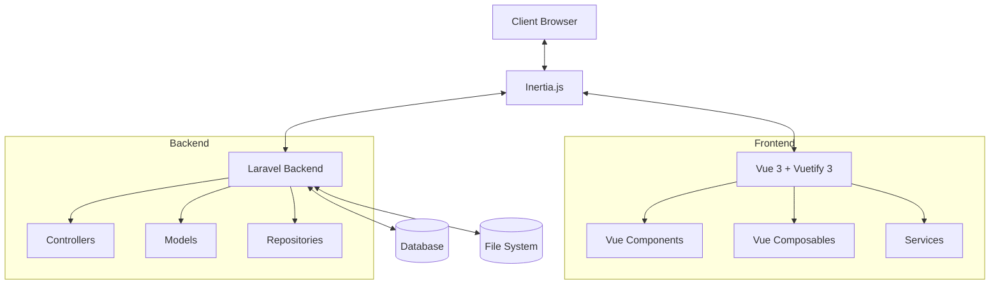

# Technical Specification

This document provides a comprehensive technical specification for the FaithMedia project, covering project overview, architecture, technical stack, application routes, features, authentication configuration, deployment, and migration considerations.

## Table of Contents

1. [Project Overview](#project-overview)
2. [Architecture & Design](#architecture--design)
3. [Technical Stack](#technical-stack)
4. [Application Routes](#application-routes)
5. [Features](#features)
6. [Authentication Configuration](#authentication-configuration)
7. [Deployment](#deployment)
8. [Migration Considerations](#migration-considerations)
9. [Related Documentation](#related-documentation)

## Project Overview

FaithMedia is a comprehensive media management system designed for Faith FM to handle their content library. The platform enables efficient management of audio content through a modern web interface.

### Business Context

The system serves multiple user roles with specific needs:
- **Producers**: Upload and manage content (TODO: upload capability)
- **Review Team**: Provide feedback on songs and content
- **Content Managers**: Review feedback and manage content library
- **Administrators**: System and user management

### Current State

The platform has completed its Vue 3 migration and features a mature implementation with:
- **Completed Features:**
  - Full Vue 3 + Composition API + TypeScript implementation
  - Comprehensive component library with mobile/desktop responsive design
  - Server-side cursor-based pagination with caching optimizations
  - Integrated audio player with advanced controls
  - Content metadata editing capabilities
  - Song review system with approval workflows
  - Error handling with custom error pages
  - Performance optimizations including smart caching strategies

- **Current Focus Areas:**
  - Upload capability development (UI components exist, backend integration pending)
  - Continued performance optimizations
  - Testing framework implementation (Vitest + Vue Test Utils setup complete)

## Architecture & Design

### System Architecture

The FaithMedia project follows a modern client-server architecture using Laravel as the backend framework and Vue 3 with Inertia.js for the frontend. This architecture provides several advantages:

- **Monolithic Simplicity**: By using Inertia.js, we maintain the simplicity of a monolithic application while gaining the benefits of a modern SPA.
- **Progressive Enhancement**: The application works even without JavaScript, as Inertia.js supports server-side rendering.
- **Reduced API Complexity**: No need to build and maintain a separate API layer.
- **Shared Authentication**: Authentication is handled by Laravel, eliminating the need for token management.

### High-Level Architecture Diagram



### Key Components

#### 1. Backend
   - Laravel-based REST API
   - Custom authentication system
   - Database management through Nova
   - Stateful session-based authentication (vs JWT)
   - API routes in `api.php` with stateful authentication enabled
   - Auditing system for tracking changes
   - New Relic monitoring integration

#### 2. Frontend
   - Multi-Page Application (MPA) using Inertia
   - Vue 3 components with Composition API
   - Vuetify 3 for UI components (with auto-import)
   - Flat component structure:
     ```
     resources/js/
       ├── Pages/              # Inertia page components
       │   ├── Content.vue
       │   ├── Error.vue
       │   ├── ReviewSongs.vue
       │   └── ReviewSongsSummary.vue
       ├── Components/         # All Vue components
       │   ├── AudioPlayer.vue
       │   ├── BaseView.vue
       │   ├── BreadcrumbsNav.vue
       │   ├── ContentNavToolbar.vue
       │   ├── DesktopControls.vue
       │   ├── DetailsView.vue
       │   ├── EditableTable.vue
       │   ├── ErrorDisplay.vue
       │   ├── FolderPanel.vue
       │   ├── MobileControls.vue
       │   ├── MobileSearchDialog.vue
       │   ├── PlaylistView.vue
       │   ├── ReviewCard.vue
       │   ├── ReviewStatusChip.vue
       │   ├── SkeletonDetailsView.vue
       │   ├── SkeletonPlaylistView.vue
       │   └── SongReviewDialog.vue
       ├── composables/        # Vue composables (TypeScript)
       │   ├── useAudioPlayer.ts
       │   ├── useContentHelpers.ts
       │   ├── useDbContentUrls.ts
       │   ├── useErrorHandling.ts
       │   ├── useNavigation.ts
       │   ├── useNotifications.ts
       │   ├── useReviews.ts
       │   ├── useReviewSummaries.ts
       │   ├── useRowSelection.ts
       │   ├── useSearchHighlighting.ts
       │   └── useSharedData.ts
       ├── services/          # Services (TypeScript)
       │   └── SearchService.ts
       └── types/             # TypeScript types
     ```
   - Media player components:
     - Player controls interface (using Howler.js)
     - Player information panel
   - Content management:
     - Metadata editing interface
     - Content sorting and filtering
   - Search functionality:
     - Client-side smart search implementation
     - Dynamic filtering and sorting
     - Prefilter support
   - Configuration injection via window.xxx variables
   - Hybrid architecture (not strictly SPA)
     - Vue frontend served by Laravel Blade template
     - Some routes bypass Vue entirely
     - Data sourced via Inertia.js page props and partial reloads
   - Error Handling:
     - Standardized error pages (401, 403, 404, 500, 503)
     - Custom error component using Tailwind CSS for styling
     - Sheep-themed error messages with consistent visual design
     - Interactive error pages with back/login actions

### Key Design Decisions

#### 1. Inertia.js over Traditional SPA

We chose Inertia.js over a traditional SPA architecture for several reasons:

- **Simplified Development**: No need to build and maintain a separate API
- **Shared Authentication**: Uses Laravel's built-in authentication
- **Reduced Complexity**: Fewer moving parts and potential points of failure
- **Progressive Enhancement**: Works even without JavaScript

#### 2. Composition API over Options API

We chose the Composition API over the Options API for:

- **Better Code Organization**: Related code is grouped together
- **Improved Type Safety**: TypeScript integration is more natural
- **Enhanced Reusability**: Logic can be extracted into composables
- **More Flexibility**: More control over code structure

#### 3. Cursor-Based Pagination over Offset Pagination

We implemented cursor-based pagination for:

- **Consistent Performance**: Performance remains stable regardless of offset
- **Reduced Database Load**: More efficient queries
- **Better Cache Utilization**: More cache-friendly queries

#### 4. Component Hierarchy

We designed the component hierarchy to:

- **Maximize Reusability**: Components are designed to be reusable
- **Minimize Prop Drilling**: Composables are used to share state
- **Separate Concerns**: Each component has a single responsibility
- **Optimize Performance**: Components are optimized for rendering performance

## Technical Stack

### Backend
- **Core Framework:** Laravel 10.48.29 (PHP ^8.1)
- **Authentication:** 
  - Custom AuthZ/AuthN package
  - Faith FM Laravel Auth0 Pattern (^4.0.2)
- **Administration:** Laravel Nova (^5.4.4)
- **Monitoring & Debugging:**
  - New Relic integration (faithfm/new-relic-helper ^1.0.4)
  - Clockwork debugging (^5.3.4)
- **Auditing:** Laravel Auditing (^13.7.2)
- **Search:** Faith FM Smart Search PHP (^2.4.1)

### Frontend
- **Core Framework:** 
  - Vue 3(3.4.21) (Composition API)
  - Vuetify 3 (^3.6.11)
  - Inertia.js (^2.0.12)
- **Build System:**
  - Vite (^6.3.5)
  - Laravel Vite plugin (^1.0.5)
  - PostCSS (^8.4.47)
  - Asset URL transformation
  - Path aliasing (@/ for resources/js)
- **Styling:**
  - Vuetify for primary UI components (with auto-import via vite-plugin-vuetify ^2.0.3)
  - TailwindCSS (^3.4.13) - Used specifically for error page styling
  - SASS (^1.80.0)
- **Audio Processing:** Howler.js (^2.2.0)
- **Utilities:**
  - VueUse Core (^11.2.0)
  - LZ-String (^1.4.4) - compression
  - NoSleep.js (^0.9.0) - screen wake lock

### Development Tools
- **Testing Framework:**
  - Vitest (^3.0.7) for JavaScript/TypeScript testing
  - PHPUnit (^10.5.46) for PHP testing
  - Vue Test Utils (^2.4.0-alpha.2) for Vue component testing
  - Testing Library Vue (^8.1.0) for component testing utilities
  - Happy DOM (^17.1.9) for DOM simulation
- **Code Quality:**
  - ESLint (^8.57.1) with Vue and Vuetify plugins
  - TypeScript ESLint parser and plugin (^8.18.1)
- **Development Server:**
  - Hot Module Replacement (HMR)
  - TLS detection for local development (faithmedia-v1.test)
  - CORS configuration for development
- **Build Tools:**
  - Cross-env (^7.0.3) for cross-platform environment variables
  - Autoprefixer (^10.4.20) for CSS vendor prefixes

## Application Routes

### Core Routes
- **/nova** - Nova admin UI (with custom login/logout redirects)
- **/** - Root route (redirects to /content)
- **/phpinfo** - PHP information page (authenticated users only)
- **/clear-cache** - Cache clearing endpoint (admin only)

### Authentication Routes
- **/login** - Auth0 login
- **/logout** - Auth0 logout  
- **/auth0/callback** - Auth0 callback handler

### Song Review Routes [IAP]
- **/review-songs** - Song review interface for reviewers
  - Permissions: `review-songs|admin-media|admin-master`

## Song Review Summary Routes [IAP]  
- **/review-songs-summary** - Song review summary interface for content managers
  - Permissions: `review-songs-summary|admin-media|admin-master`

### Content Routes [IAP]
- **/content/{path?}** - Content management (supports nested paths)
  - Optional URL parameters:
    - `prefilter`: Filter preset identifier
    - `search`: Search query string
    - `sort`: Sort direction ('asc' or 'desc')
    - `layout`: View layout type
    - `includeSubfolders`: Boolean for subfolder inclusion
    - `cursor`: Pagination cursor
- **PUT /content/metadata** - Content metadata update endpoint

### API Routes
- **GET /api/user** - Get authenticated user information
- **GET /api/prefilters** - Get all prefilters
- **GET /api/current_song_rotation** - Get current song rotation for public website
- **/api/publicusers** - Public user CRUD operations
- **/api/publicusers/{publicUser}/contentbookmarks** - User content bookmarks management

Note: [IAP] indicates routes that include the integrated audio player

## Features

### Content Page Specification

#### Routes & Parameters
- Base Route: `/content/{path?}` (supports nested paths with wildcard matching)
- Optional URL Parameters:
  - `prefilter`: Filter preset identifier
  - `search`: Search query string
  - `sort`: Sort direction ('asc' or 'desc')
  - `layout`: View layout type
  - `includeSubfolders`: Boolean for subfolder inclusion (default: false)
  - `cursor`: Pagination cursor for server-side pagination

#### State Management
- **URL Parameters** (with defaults):
  - `path`: '' (blank)
  - `prefilter`: '' (blank) - can be inferred from path if it matches a prefilter pattern
  - `search`: '' (blank)
  - `sort`: 'asc'
  - `layout`: Depends on mode
  - `includeSubfolders`: false
  - `cursor`: 0

- **Computed State**:
  - `mode`: Determined by search field
    - 'search' when search is non-blank
    - 'folder' when search is blank
  - `activePrefilter`: Either explicit prefilter or inferred from path
  - `effectiveRoot`: Prefilter root path or current path

#### Views
1. **Playlist View**
   - Legacy view from Vue2 system
   - Default view for search mode
   - Menu access via "..." icon

2. **Details View**
   - Table/column view with all relevant fields
   - Horizontal scrolling enabled
   - Split file field into path/filename columns
   - Default view for folder mode

**Common View Features:**
- Folder list display (folder mode only)
- Search results include sub-folder content
- Row Selection:
  - Hard color for selected row
  - Soft color for playing row
- Double-click Actions:
  - Play
  - View details
  - Download
  - Go to folder (search mode only)

#### Navigation Bar
- **Components:**
  1. Filter Chip
     - Shows filter icon + "Filter" when blank
     - Shows filter description + clear X when active
     - Pop-up menu with recent filters (up to 4) + all filters
     - When selected, prefilters with path patterns update the URL to reflect the path
  2. Folder Field
     - Folder icon with recent folders popup (up to 20)
  3. Parent Folder Button
  4. View Toggle
  5. Search Field
     - Search icon with recent searches popup (up to 20)
     - Clear X when active
  6. Sort Toggle (asc/desc)
  7. Upload Button (hidden in search mode)

- **URL Override Behavior:**
  - Prefilters use query parameters (e.g., `/content?prefilter=biblestudy`)
  - Creates consistent URLs across the application
  - Includes subfolders by default in all contexts
  - Frontend maintains awareness of which prefilter is active

- **State Storage:**
  - Recent filters/folders/searches stored in localStorage
  - Shared with Start page

#### Pagination Implementation
**Offset-Based Pagination with WhenVisible**
- Server-side offset-based pagination with 500 items per page
- Uses `cursor` URL parameter to track offset position
- Implements infinite scrolling using Inertia's WhenVisible component
- Implements `hasMore` flag and `nextCursor` for frontend pagination controls
- Caching strategy:
  - Prefilters cached for 1 hour (rarely change)
  - Folder results cached for 15 minutes (non-search queries only)
  - Search results not cached (more dynamic)

### Currently Implemented Features
- Content Management
  - Preview Faith FM content/media library
  - Content bookmarking (via PublicUserContentBookmarkController)
  - Integrated audio player with controls and info panel
  - Metadata editing capabilities through content API
  - Content sorting and filtering

- Search Capabilities (Frontend-based)
  - Smart search filtering
  - Predefined filtered content types
  - Search within filtered content
  - Content sorting options

- Review System
  - Song review submission (via SongReviewController)
  - Song review feedback summary (via SongReviewSummaryController)
  - Content Manager review tools

- User Management
  - Public user system (via PublicUserController)
  - Administrative user management through Nova

### Planned Features
- Content Management
  - Upload interface for new content
  - Content organization by folders
- Search Capabilities
  - Migration to server-side search functionality

## Authentication Configuration

### Auth0 Setup
1. Create new application in Auth0 Dashboard:
   - Select "Regular Web Applications"
   - Choose PHP(Laravel) in Quick Start

2. Configure Application Settings:
   - Allowed Callback URLs:
     ```
     http://faithmedia-v1.myserver.com/auth0/callback
     http://faithmedia-v1-staging.myserver.com/auth0/callback
     http://faithmedia-v1.test/auth0/callback
     ```
   - Allowed Logout URLs:
     ```
     http://faithmedia-v1.myserver.com
     http://faithmedia-v1-staging.myserver.com
     http://faithmedia-v1.test
     ```
   - Allowed Web Origins & CORS:
     ```
     http://faithmedia-v1.myserver.com
     http://faithmedia-v1-staging.myserver.com
     http://faithmedia-v1.test
     ```

3. Environment Configuration:
   ```bash
   AUTH0_DOMAIN=xxxx.yy.auth0.com
   AUTH0_CLIENT_ID=XXXXXXX
   AUTH0_CLIENT_SECRET=XXXXXXXXXXXXXXX
   ```

4. Universal Login Customization:
   ```html
   <script>
   var lock = new Auth0Lock(config.clientID, config.auth0Domain, {
     additionalSignUpFields: [{
       name: "name",
       placeholder: "Enter your full name",
       storage: "root",
     }]
   });
   </script>
   ```

## Deployment

### System Requirements
- PHP ^8.1
- Node.js (for frontend build)
- No cronjobs required
- No daemons or queue workers needed

### Configuration Requirements
Required configuration files in project root:
- `.env`
- `auth.json`

### Deployment Scripts

#### Production Deployment (Laravel Forge)
```bash
# Clear sessions
find storage/framework/sessions/ -type f -delete

# Update codebase
git fetch origin master
git checkout -f master
git reset --hard origin/master

# Install dependencies
composer install --no-interaction --prefer-dist --optimize-autoloader

# Restart PHP-FPM
( flock -w 10 9 || exit 1
    echo 'Restarting FPM...'; sudo -S service php8.1-fpm reload ) 9>/tmp/fpmlock

# Restart queue workers
php artisan queue:restart

# Clear cache
php artisan cache:clear
```

#### Staging Deployment (Post-receive hook)
```bash
# Update codebase
git checkout -f $newrev
git clean -f -d

# Install dependencies
composer install --no-interaction --prefer-dist --optimize-autoloader

# Restart PHP-FPM
( flock -w 10 9 || exit 1
    echo 'Restarting FPM...'; sudo -S service php8.1-fpm reload ) 9>/tmp/fpmlock
```

## Migration Considerations
- Maintaining compatibility with transitional Vue 2 environment
- Gradual feature migration strategy
- Preserving existing functionality during transitions
- Database migrations handled carefully (shared tables across environments)

## Related Documentation

- [Architecture Documentation](Architecture.md) - Detailed system architecture and structure
- [Migration Guide](MigrationGuide.md) - Vue2 to Vue3 migration reference
- [API & Technical Implementation](API.md) - API reference and technical details
- [Component Documentation](Components.md) - UI component documentation
- [Development Guidelines](DevelopmentGuidelines.md) - Code standards and best practices
- [Feature Documentation](Features.md) - Specific feature documentation
- [User Guide](UserGuide.md) - End-user documentation
- [Authentication Guide](README-Auth0-config.md) - Authentication configuration
