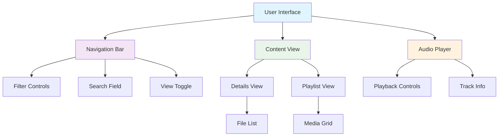

# User Guide

This document provides comprehensive user documentation for the FaithMedia content page, including feature guides, UI documentation, troubleshooting information, and keyboard shortcuts.

## Table of Contents

1. [Introduction](#introduction)
2. [Feature Guides](#feature-guides)
   - [Folder Navigation](#folder-navigation)
   - [Search Functionality](#search-functionality)
   - [Filtering Content](#filtering-content)
   - [View Switching](#view-switching)
   - [Sorting Content](#sorting-content)
   - [Media Playback](#media-playback)
   - [Item Selection](#item-selection)
   - [Context Menu Actions](#context-menu-actions)
   - [Song Review System](#song-review-system)
3. [UI Documentation](#ui-documentation)
   - [Navigation Bar](#navigation-bar)
   - [Details View](#details-view)
   - [Playlist View](#playlist-view)
   - [Audio Player](#audio-player)
   - [Notifications](#notifications)
   - [Loading States](#loading-states)
   - [Error States](#error-states)
4. [Troubleshooting Guide](#troubleshooting-guide)
   - [Common Issues](#common-issues)
   - [Error Messages](#error-messages)
   - [Performance Issues](#performance-issues)
   - [Browser Compatibility](#browser-compatibility)
5. [Keyboard Shortcuts and Accessibility Features](#keyboard-shortcuts-and-accessibility-features)
   - [Keyboard Shortcuts](#keyboard-shortcuts)
   - [Accessibility Features](#accessibility-features)
   - [Screen Reader Support](#screen-reader-support)

## Introduction

The content page provides a modern interface for browsing, searching, and interacting with media content. It offers two main modes:

- **Folder Mode**: Browse content organized in folders
- **Search Mode**: Search across all content with powerful filtering options

The interface is designed to be intuitive, responsive, and accessible, with support for keyboard navigation and screen readers.

### System Overview

*Figure 1: Main components of the FaithMedia interface*

## Feature Guides

### Folder Navigation

#### Browsing Folders

1. **Navigate to a folder**: Click on a folder in the folder list or enter a path in the folder field
2. **Navigate to parent folder**: Click the "Parent Folder" button (up arrow) in the navigation bar
3. **View folder contents**: Contents of the current folder are displayed in the main view
4. **Recent folders**: Click the folder field to see a dropdown of recently visited folders

#### Path Navigation

The path field in the navigation bar shows your current location. You can:

- **Enter a path directly**: Type a path and press Enter
- **Select from history**: Click the folder field to see recently visited folders
- **Navigate up**: Click the parent folder button to move up one level

### Search Functionality

#### Basic Search

1. **Perform a search**: Enter a search term in the search field and press Enter
2. **Clear search**: Click the X button in the search field or delete the search text
3. **View search results**: Results are displayed in the main view, with search terms highlighted

#### Advanced Search

The search supports advanced query syntax:

- **Multiple terms**: Space-separated terms are treated as AND (e.g., "sermon music")
- **Quoted phrases**: Use quotes for exact phrases (e.g., "John Doe")
- **Boolean operators**: Use AND, OR, NOT (e.g., "sermon AND music NOT children")
- **Parentheses**: Group terms with parentheses (e.g., "(sermon OR message) AND music")

#### Search History

1. **View search history**: Click the search field to see a dropdown of recent searches
2. **Select from history**: Click a recent search to perform that search again

### Filtering Content

#### Using Prefilters

1. **Apply a filter**: Click the filter chip in the navigation bar to see available filters
2. **Select a filter**: Click a filter from the dropdown to apply it
3. **Clear filter**: Click the X on the active filter chip or select "Clear Filter" from the dropdown

#### Filter Types

- **Content type filters**: Filter by content type (e.g., Music, Sermons, Children's)
- **Format filters**: Filter by format (e.g., MP3, WAV)
- **Custom filters**: Custom filters defined by administrators

#### Combining Filters with Search

Filters can be combined with search terms for more specific results:

1. **Apply a filter**: Select a filter from the dropdown
2. **Add search terms**: Enter search terms in the search field
3. **View filtered search results**: Results matching both the filter and search terms are displayed

### View Switching

#### Available Views

- **Details View**: Table-based view with detailed information (default for folder mode)
- **Playlist View**: Grid-based view optimized for media (default for search mode)

#### Switching Views

1. **Toggle view**: Click the view toggle button in the navigation bar
2. **View persistence**: The system remembers your preferred view for each mode

### Sorting Content

#### Sort Options

- **Ascending**: Sort alphabetically A-Z
- **Descending**: Sort alphabetically Z-A

#### Changing Sort Order

1. **Toggle sort**: Click the sort toggle button in the navigation bar
2. **View sort indicator**: The sort button shows the current sort direction

### Media Playback

#### Playing Media

1. **Play an item**: Click the play button on an item or select "Play" from the context menu
2. **View now playing**: The currently playing item is highlighted
3. **Control playback**: Use the audio player controls at the bottom of the screen

#### Audio Player Controls

- **Play/Pause**: Toggle playback
- **Skip**: Skip to the next or previous track
- **Volume**: Adjust volume with the volume slider
- **Seek**: Seek to a specific position with the progress bar
- **Time**: View current time and total duration

### Item Selection

#### Selecting Items

- **Single selection**: Click on an item to select it
- **Multiple selection**: Hold Ctrl (Cmd on Mac) and click items to select multiple
- **Range selection**: Select an item, then hold Shift and click another item to select all items in between

#### Working with Selection

- **View selection**: Selected items are highlighted
- **Clear selection**: Click in an empty area or press Esc
- **Perform actions**: Right-click a selected item to see available actions

### Context Menu Actions

#### Available Actions

- **Play**: Play the selected item
- **Details**: View detailed information about the item
- **Go to folder**: Navigate to the item's folder (search mode only)

#### Using the Context Menu

1. **Open context menu**: Right-click on an item or selection
2. **Select an action**: Click on an action in the context menu
3. **View result**: The selected action is performed

## UI Documentation

### Navigation Bar

The navigation bar at the top of the page provides access to the main functionality:

#### Components

1. **Filter Chip**: Shows the current filter and provides access to available filters
   - Blank state: Filter icon + "Filter" text
   - Active state: Filter icon + filter description + clear X
2. **Folder Field**: Shows the current folder path
   - Folder icon inside field
   - Click shows up to 20 recently-viewed folders
3. **Parent Folder Button**: Navigates to the parent folder
4. **View Toggle**: Switches between Details and Playlist views
5. **Search Field**: Allows searching for content
   - Magnifying glass icon (shows up to 20 recent searches)
   - Clear X when search is non-blank
6. **Sort Toggle**: Toggles between ascending and descending sort
7. **Upload Button**: Planned feature for content upload (currently not functional, hidden in search mode)

### Details View

The Details view displays content in a table format with detailed information:

#### Features

- **Columns**: File, Series, Numbers, Content, Guests, Tags, Size, Duration, Date
- **Horizontal Scrolling**: Scroll horizontally to see all columns
- **Row Selection**: Click to select rows
- **Context Menu**: Right-click for actions
- **Double-Click**: Double-click to play

### Playlist View

The Playlist view displays content in a grid format optimized for media:

#### Features

- **Grid Layout**: Items displayed in a responsive grid
- **Media Preview**: Visual preview of media items
- **Item Selection**: Click to select items
- **Context Menu**: Right-click for actions
- **Double-Click**: Double-click to play
- **Action Menu**: "..." icon for quick actions

### Audio Player

The audio player provides controls for media playback:

#### Components

1. **Play/Pause Button**: Toggles playback
2. **Previous/Next Buttons**: Navigate between tracks
3. **Progress Bar**: Shows playback progress and allows seeking
4. **Time Display**: Shows current time and total duration
5. **Volume Control**: Adjusts volume
6. **Track Information**: Shows title, artist, and album

### Scroll-to-Top Button

A scroll-to-top button is available to quickly return to the top of the page:

#### Features

- **Automatic Display**: Button appears when scrolling down the page
- **Responsive Positioning**: Adapts to different screen sizes
- **One-Click Navigation**: Click to smoothly scroll back to the top
- **Accessibility**: Designed to be accessible with keyboard navigation

### Notifications

Notifications provide feedback about system events:

#### Types

- **Success**: Green notification for successful operations
- **Error**: Red notification for errors
- **Warning**: Yellow notification for warnings
- **Info**: Blue notification for information

#### Behavior

- **Auto-dismiss**: Notifications automatically dismiss after a few seconds
- **Manual dismiss**: Click the X to dismiss a notification
- **Stacking**: Multiple notifications stack vertically

### Loading States

Loading states provide feedback during data loading:

#### Types

- **Initial Loading**: Skeleton loaders shown during initial page load
- **Pagination Loading**: Loading indicator shown when loading more items
- **Action Loading**: Loading indicators for specific actions

### Error States

Error states provide feedback when errors occur:

#### Types

- **Connection Error**: Shown when the server cannot be reached
- **Authentication Error**: Shown when authentication fails
- **Permission Error**: Shown when the user lacks permission
- **Not Found Error**: Shown when content cannot be found
- **Server Error**: Shown when the server encounters an error

#### Features

- **Error Message**: Clear description of the error
- **Retry Button**: Allows retrying the operation
- **Error Details**: Additional details about the error (if available)

## Troubleshooting Guide

### Common Issues

#### Issue: Content Not Loading

**Symptoms:**
- Blank screen or loading indicator that never completes
- Error message about failed content loading

**Possible Causes:**
- Network connectivity issues
- Server unavailability
- Authentication issues

**Solutions:**
1. Check your internet connection
2. Refresh the page
3. Clear browser cache
4. Check if you're logged in
5. Contact support if the issue persists

#### Issue: Search Not Working

**Symptoms:**
- No results for search terms that should match content
- Error message about search failure

**Possible Causes:**
- Incorrect search syntax
- Search index issues
- Server-side search errors

**Solutions:**
1. Check your search syntax
2. Try simpler search terms
3. Clear any active filters
4. Refresh the page
5. Contact support if the issue persists

#### Issue: Media Not Playing

**Symptoms:**
- Play button doesn't respond
- Audio player shows but no sound
- Error message about playback failure

**Possible Causes:**
- Unsupported media format
- Network connectivity issues
- Browser audio issues

**Solutions:**
1. Check if your browser supports the media format
2. Check your internet connection
3. Check if your device's sound is on and volume is up
4. Try a different browser
5. Contact support if the issue persists

### Error Messages

#### "Failed to load content"

**Cause:** The system couldn't load content from the server.

**Solution:**
1. Check your internet connection
2. Refresh the page
3. Try again later
4. Contact support if the issue persists

#### "Search failed"

**Cause:** The system couldn't complete the search operation.

**Solution:**
1. Check your search syntax
2. Try a simpler search query
3. Refresh the page
4. Contact support if the issue persists

#### "Playback error"

**Cause:** The system couldn't play the selected media.

**Solution:**
1. Check if your browser supports the media format
2. Check your internet connection
3. Try a different browser
4. Contact support if the issue persists

#### "Authentication required"

**Cause:** You need to be logged in to access this content.

**Solution:**
1. Log in to your account
2. If already logged in, try logging out and back in
3. Contact support if the issue persists

### Performance Issues

#### Slow Loading

**Symptoms:**
- Content takes a long time to load
- Interface feels sluggish

**Possible Causes:**
- Slow internet connection
- Large amount of content
- Browser performance issues

**Solutions:**
1. Check your internet connection
2. Close unused browser tabs
3. Clear browser cache
4. Use a more powerful device if possible
5. Contact support if the issue persists

#### Browser Freezing

**Symptoms:**
- Browser becomes unresponsive
- High CPU or memory usage

**Possible Causes:**
- Too many items loaded
- Browser memory issues
- Conflicting browser extensions

**Solutions:**
1. Refresh the page
2. Close unused browser tabs
3. Disable browser extensions
4. Restart your browser
5. Contact support if the issue persists

### Browser Compatibility

#### Supported Browsers

- **Chrome**: Version 90 or later
- **Firefox**: Version 88 or later
- **Safari**: Version 14 or later
- **Edge**: Version 90 or later

#### Known Browser Issues

- **Safari**: Some audio formats may not play
- **Internet Explorer**: Not supported
- **Mobile Browsers**: Limited functionality on small screens

## Keyboard Shortcuts and Accessibility Features

### Keyboard Shortcuts

| Shortcut | Action |
|----------|--------|
| `Enter` (in search field) | Perform search |
| `Esc` | Clear selection |
| `Space` | Play/pause (when item is selected) |
| `Up/Down` | Navigate items (in Details view) |
| `Left/Right` | Navigate items (in Playlist view) |
| `Ctrl+A` (Cmd+A on Mac) | Select all items |
| `Ctrl+Click` (Cmd+Click on Mac) | Add to selection |
| `Shift+Click` | Select range |
| `Alt+Up` | Navigate to parent folder |
| `Alt+V` | Toggle view |
| `Alt+S` | Toggle sort |
| `Alt+F` | Focus filter |
| `Alt+P` | Focus path |
| `Alt+Q` | Focus search |

### Accessibility Features

#### Keyboard Navigation

- **Tab Navigation**: All interactive elements are accessible via Tab
- **Focus Indicators**: Visible focus indicators for keyboard navigation
- **Skip Links**: Hidden links to skip to main content

#### Screen Reader Support

- **ARIA Attributes**: ARIA roles, labels, and descriptions for screen readers
- **Semantic HTML**: Proper HTML semantics for better accessibility
- **Announcements**: Dynamic announcements for state changes

#### Visual Accessibility

- **Color Contrast**: High contrast between text and background
- **Text Sizing**: Support for browser text resizing
- **Focus Visibility**: Clear visual indicators for keyboard focus

### Screen Reader Support

The content page is designed to work with screen readers, with the following features:

- **Descriptive Alt Text**: All images have descriptive alt text
- **ARIA Landmarks**: Proper ARIA landmarks for navigation
- **Live Regions**: ARIA live regions for dynamic content updates
- **Focus Management**: Proper focus management for modal dialogs
- **Keyboard Shortcuts**: All functionality accessible via keyboard

#### Screen Reader Testing

The content page has been tested with the following screen readers:

- **NVDA**: Windows
- **VoiceOver**: macOS and iOS
- **JAWS**: Windows
- **TalkBack**: Android

## Conclusion

This user guide provides a comprehensive reference for using the FaithMedia content page. If you encounter any issues not covered in this documentation, please contact support for assistance.

## Related Documentation

- [Technical Specification](TechnicalSpecification.md) - Comprehensive technical specification
- [Architecture Documentation](Architecture.md) - Detailed system architecture and structure
- [API & Technical Implementation](API.md) - API reference and technical details
- [Component Documentation](Components.md) - UI component documentation
- [Development Guidelines](DevelopmentGuidelines.md) - Code standards and best practices
- [Feature Documentation](Features.md) - Specific feature documentation
- [Authentication Guide](README-Auth0-config.md) - Authentication configuration
